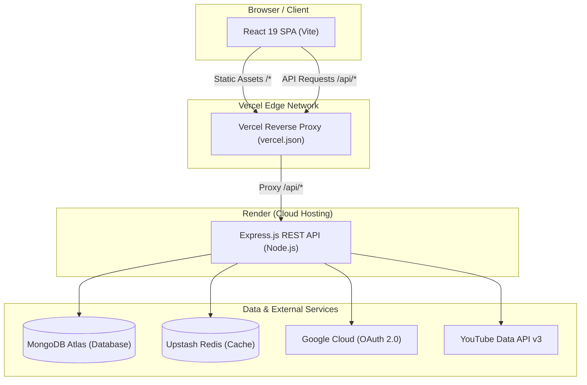

# 🔄 LearnLoop

> **Turn scattered YouTube playlists into structured, distraction-free learning paths.**  
> Track your progress, write timestamped notes that auto-save, and search across your entire personal knowledge base.

---

## 📑 Table of Contents

- [Overview](#-overview)
- [System Architecture](#-system-architecture)
- [Technology Stack](#-technology-stack)
- [Complete File & Directory Map](#-complete-file--directory-map)
  - [Root Level](#1-root-level)
  - [Backend (`/backend`)](#2-backend-backend)
  - [Frontend (`/frontend`)](#3-frontend-frontend)
- [Database Models & Collections](#-database-models--collections)
  - [1. User Model (`User`)](#1-user-model-user)
  - [2. LearningPath Model (`LearningPath`)](#2-learningpath-model-learningpath)
  - [3. Video Model (`Video`)](#3-video-model-video)
- [API Reference](#-api-reference)
  - [Auth Endpoints (`/api/auth`)](#auth-endpoints-apiauth)
  - [User & Category Endpoints (`/api/user`)](#user--category-endpoints-apiuser)
  - [Learning Path Endpoints (`/api/paths`)](#learning-path-endpoints-apipaths)
  - [Video & Notes Endpoints (`/api/videos`)](#video--notes-endpoints-apivideos)
  - [Search Endpoints (`/api/search`)](#search-endpoints-apisearch)
  - [System Health (`/api/health`)](#system-health-apihealth)
- [Security & Authentication Flow](#-security--authentication-flow)
- [Local Development Setup](#-local-development-setup)
- [Production Deployment Guide](#-production-deployment-guide)

---

## 🌟 Overview

YouTube is home to world-class educational content, but its recommendation algorithms, comments, and distractions hinder structured learning. **LearnLoop** transforms any YouTube playlist into an interactive, organized curriculum:

- **1-Click Import**: Paste any public YouTube playlist URL to pull complete video metadata, titles, and runtimes.
- **Distraction-Free Video Workspace**: Watch videos in an ad-free container alongside a dedicated note editor.
- **Auto-Saving Timestamped Notes**: Write markdown notes that automatically save to your database as you type.
- **Global Note Search**: Search your notes across all playlists and videos using MongoDB full-text search.
- **Dynamic Category Management**: Group learning paths by custom subjects (*"All"*, *"Computer Science"*, *"Mathematics"*, etc.).
- **Progress Tracking**: Real-time completion percentages, unwatched counters, and a "Continue Learning" dashboard card.

---

## 🏗 System Architecture



---

## 💻 Technology Stack

### Frontend
- **Framework**: [React 19](https://react.dev/) with [Vite](https://vitejs.dev/)
- **Routing**: [React Router v7](https://reactrouter.com/)
- **HTTP Client**: [Axios](https://axios-http.com/) (configured with credentials and global 401 interceptor)
- **Styling**: Vanilla CSS Design Tokens + [Tailwind CSS v4 Vite Plugin](https://tailwindcss.com/)
- **Typography & Icons**: Inter Font (Google Fonts), Custom SVG icon library

### Backend
- **Runtime**: [Node.js](https://nodejs.org/) (CommonJS)
- **Framework**: [Express.js 5](https://expressjs.com/)
- **Database**: [MongoDB Atlas](https://www.mongodb.com/atlas) with [Mongoose 9](https://mongoosejs.com/)
- **Caching**: [Upstash Redis](https://upstash.com/) with native `redis` client
- **Authentication**: Google OAuth 2.0 (`google-auth-library`) + JWT (`jsonwebtoken`) in `httpOnly` cookies
- **Security & Validation**: `helmet`, `cors`, `cookie-parser`, `express-rate-limit`, `express-validator`
- **External Integration**: `googleapis` (YouTube Data API v3)

---

## 📂 Complete File & Directory Map

```text
LearnLoop/
├── .gitignore                          # Root Git ignore rules (protects all .env secrets)
├── README.md                           # Master project documentation
│
├── backend/                            # Node.js & Express REST API
│   ├── .env                            # Local environment variables (Ignored by Git)
│   ├── package.json                    # Backend dependencies and scripts
│   ├── package-lock.json               # Backend lockfile
│   ├── server.js                       # Express app initialization & server entry point
│   │
│   ├── config/                         # Infrastructure & external service configs
│   │   ├── cache.js                    # Redis cache helpers (get, set, delete, key generators)
│   │   ├── db.js                       # MongoDB connection via Mongoose
│   │   └── redis.js                    # Upstash Redis client with graceful failure handling
│   │
│   ├── controllers/                    # Request handlers / Business logic
│   │   ├── authController.js           # Google OAuth URL, callback, profile fetch, logout
│   │   ├── pathController.js           # Learning path CRUD, playlist import, progress calculations
│   │   ├── searchController.js         # Full-text search across user video notes
│   │   ├── userController.js           # Custom category CRUD (get, create, rename, delete)
│   │   └── videoController.js          # Video fetching, status update, note updating
│   │
│   ├── middleware/                     # Express middlewares
│   │   ├── auth.js                     # JWT verification from httpOnly cookie
│   │   ├── errorHandler.js             # Global error handler with formatted JSON responses
│   │   └── rateLimiter.js              # Rate limiters (global, auth, and import endpoints)
│   │
│   ├── models/                         # Mongoose schemas and models
│   │   ├── index.js                    # Central export for all models
│   │   ├── LearningPath.js             # Schema for imported playlists
│   │   ├── User.js                     # Schema for authenticated users & categories
│   │   └── Video.js                    # Schema for individual videos & notes
│   │
│   ├── routes/                         # Express route definitions
│   │   ├── auth.js                     # Routes for /api/auth
│   │   ├── paths.js                    # Routes for /api/paths
│   │   ├── search.js                   # Routes for /api/search
│   │   ├── user.js                     # Routes for /api/user
│   │   └── videos.js                   # Routes for /api/videos
│   │
│   ├── services/                       # External third-party service abstractions
│   │   ├── googleAuthService.js        # Google OAuth2 client & ID token verifier
│   │   └── youtubeService.js           # YouTube Data API v3 playlist & video metadata fetcher
│   │
│   └── validators/                     # Request input sanitization & validation
│       ├── pathValidator.js            # Validation rules for path creation & updates
│       ├── validate.js                 # Validation results checking middleware
│       └── videoValidator.js           # Validation rules for video status & notes
│
└── frontend/                           # React 19 Single Page Application
    ├── .gitignore                      # Frontend-specific Git ignore rules
    ├── .oxlintrc.json                  # Oxlint configuration
    ├── index.html                      # Single page application entry HTML & SEO/Favicon meta
    ├── package.json                    # Frontend dependencies and build scripts
    ├── package-lock.json               # Frontend lockfile
    ├── vercel.json                     # Vercel deployment configuration (reverse proxy rewrites)
    ├── vite.config.js                  # Vite build settings, Tailwind v4 plugin, local dev proxy
    │
    ├── public/                         # Static assets served at root
    │   ├── favicon.svg                 # Fallback SVG favicon
    │   ├── icons.svg                   # Reusable SVG sprite
    │   └── learnloop_logo.png          # Official LearnLoop brand icon & favicon
    │
    └── src/                            # Application source code
        ├── App.jsx                     # Route declarations & route protection
        ├── index.css                   # Design tokens, color system, and global styles
        ├── main.jsx                    # React DOM root render
        │
        ├── assets/                     # Static code assets
        │   └── vite.svg                # Vite logo asset
        │
        ├── components/                 # Reusable React UI components
        │   ├── auth/
        │   │   └── ProtectedRoute.jsx  # Route guard redirecting unauthenticated users to /
        │   │
        │   ├── dashboard/
        │   │   ├── CategoryManagerModal.jsx # Modal to create, rename, and delete categories
        │   │   ├── ContinueLearningCard.jsx # Hero dashboard widget resuming last active video
        │   │   ├── ImportPathModal.jsx      # Modal with URL input to import YouTube playlist
        │   │   └── PathCard.jsx             # Grid card representing an imported course
        │   │
        │   ├── layout/
        │   │   └── Layout.jsx          # Top navbar, brand logo, search link, profile menu
        │   │
        │   ├── path/
        │   │   └── EditPathModal.jsx   # Modal to edit path title or change assigned category
        │   │
        │   └── ui/
        │       ├── Button.jsx          # Configurable button with sizes, variants, loading states
        │       ├── ConfirmDialog.jsx   # Danger / Confirmation dialog for destructive actions
        │       ├── Modal.jsx           # Accessible modal container with backdrop & escape handling
        │       ├── ProgressBar.jsx     # Visual completion percentage progress bar
        │       ├── Skeleton.jsx        # Content loading skeleton placeholders
        │       └── UIHelpers.jsx       # State badges, status tags, and mini helper components
        │
        ├── context/
        │   └── AuthContext.jsx         # React Context managing session, user info, and logout
        │
        ├── hooks/                      # Custom reusable React hooks
        │   ├── useCategories.js        # Category fetching, adding, editing, and deleting
        │   ├── useDebounce.js          # Value debouncing hook (used for note autosave)
        │   ├── usePath.js              # Fetching single path details and video items
        │   ├── usePaths.js             # Fetching all paths with category filtering
        │   ├── useSearchNotes.js       # Debounced note full-text search hook
        │   └── useVideo.js             # Video detail fetching, status updates, note saving
        │
        ├── pages/                      # Application route pages
        │   ├── Dashboard.jsx           # Main workspace displaying paths, categories, metrics
        │   ├── Landing.jsx             # Marketing landing page with interactive feature demo
        │   ├── Legal.jsx               # Terms of Service & Privacy Policy pages
        │   ├── NotesSearch.jsx         # Global note search interface across all courses
        │   ├── PathDetail.jsx          # Course overview syllabus showing full video list
        │   └── VideoDetail.jsx         # Video player view with live note-taking pane
        │
        ├── services/
        │   └── api.js                  # Central Axios instance with interceptors
        │
        └── utils/
            └── formatDuration.js       # ISO 8601 duration parser (e.g., 'PT1H23M' -> '1:23:00')
```

---

## 🗄 Database Models & Collections

LearnLoop uses MongoDB Atlas with Mongoose. All models are defined under `backend/models/`.

### 1. User Model (`User`)
Stores authenticated user profiles authenticated via Google OAuth.

| Field | Type | Attributes | Description |
| :--- | :--- | :--- | :--- |
| `_id` | `ObjectId` | Auto-generated | Primary key |
| `googleId` | `String` | Required, Unique, Indexed | The immutable `sub` claim from Google OAuth |
| `name` | `String` | Required, Trimmed | Full display name |
| `email` | `String` | Required, Unique, Lowercase | User email address |
| `avatar` | `String` | Default: `""` | URL to Google profile picture |
| `categories`| `[String]` | Default: `["All"]` | Array of custom category tags created by the user |
| `createdAt` | `Date` | Timestamp | Account creation timestamp |
| `updatedAt` | `Date` | Timestamp | Last update timestamp |

---

### 2. LearningPath Model (`LearningPath`)
Represents an imported YouTube playlist owned by a specific user.

| Field | Type | Attributes | Description |
| :--- | :--- | :--- | :--- |
| `_id` | `ObjectId` | Auto-generated | Primary key |
| `userId` | `ObjectId` | Required, Ref: `User`, Indexed | Owner reference |
| `name` | `String` | Required, Trimmed, Max: 200 | Title of the learning path |
| `description`| `String` | Trimmed, Max: 1000 | Description pulled from playlist |
| `category` | `String` | Required, Default: `"All"` | Assigned category grouping |
| `ytPlaylistId`| `String` | Default: `""` | Original YouTube playlist ID |
| `ytPlaylistUrl`| `String`| Default: `""` | Full YouTube playlist link |
| `thumbnail` | `String` | Default: `""` | URL to course thumbnail image |
| `channelTitle`| `String`| Default: `""` | Name of the YouTube channel/creator |
| `totalVideos` | `Number` | Default: `0` | Total video count |
| `createdAt` | `Date` | Timestamp | Creation timestamp |
| `updatedAt` | `Date` | Timestamp | Last update timestamp |

**Indexes**:
- `{ userId: 1 }` — Optimizes dashboard queries fetching paths owned by the user.
- `{ userId: 1, createdAt: -1 }` — Enables fast sorting by newest imported paths.
- `{ userId: 1, ytPlaylistId: 1 }` (`unique: true`, `sparse: true`) — Prevents duplicate imports of the same playlist by the same user.

---

### 3. Video Model (`Video`)
Represents an individual video within a learning path.

| Field | Type | Attributes | Description |
| :--- | :--- | :--- | :--- |
| `_id` | `ObjectId` | Auto-generated | Primary key |
| `learningPathId`| `ObjectId`| Required, Ref: `LearningPath` | Parent learning path reference |
| `userId` | `ObjectId` | Required, Ref: `User`, Indexed | Owner reference (avoids joins for auth) |
| `ytId` | `String` | Required | YouTube Video ID (e.g. `dQw4w9WgXcQ`) |
| `title` | `String` | Required, Trimmed | Video title |
| `description` | `String` | Default: `""` | Video description |
| `thumbnail` | `String` | Default: `""` | Video thumbnail image URL |
| `duration` | `String` | Default: `""` | Raw ISO 8601 duration (e.g., `"PT14M22S"`) |
| `channelTitle`| `String` | Default: `""` | Video author / channel name |
| `position` | `Number` | Required, Default: `0` | Order position within playlist (0-indexed) |
| `status` | `String` | Enum: `["to-watch", "in-progress", "completed"]` | Current learning state |
| `notes` | `String` | Default: `""` | User's personal markdown notes |
| `completedAt` | `Date` | Default: `null` | Timestamp when marked completed |
| `createdAt` | `Date` | Timestamp | Creation timestamp |
| `updatedAt` | `Date` | Timestamp | Last update timestamp |

**Indexes**:
- `{ learningPathId: 1, position: 1 }` — Fetches all videos for a path sorted in syllabus order in one scan.
- `{ userId: 1, status: 1 }` — Quickly locates unwatched videos for the "Continue Learning" banner.
- `{ notes: "text" }` — Full-text search index powering the global note search feature.

---

## 📡 API Reference

All protected endpoints require a valid JWT token in the `token` `httpOnly` cookie.

### System Health (`/api/health`)

| Method | Route | Auth | Description |
| :--- | :--- | :--- | :--- |
| `GET` | `/api/health` | Public | Returns API health status (`{ success: true, message: "..." }`) |

---

### Auth Endpoints (`/api/auth`)

| Method | Route | Auth | Description |
| :--- | :--- | :--- | :--- |
| `GET` | `/api/auth/google` | Public | Initiates Google OAuth 2.0 consent screen (Rate limited: 30 req/15min) |
| `GET` | `/api/auth/google/callback`| Public | Google OAuth redirect destination; issues JWT cookie and redirects to `/dashboard` |
| `GET` | `/api/auth/me` | Required | Returns currently authenticated user profile (Cached in Redis) |
| `POST` | `/api/auth/logout` | Required | Clears JWT cookie and invalidates user session in Redis |

---

### User & Category Endpoints (`/api/user`)

| Method | Route | Auth | Description | Request Body |
| :--- | :--- | :--- | :--- | :--- |
| `GET` | `/api/user/categories` | Required | Retrieves array of user's custom categories | None |
| `POST` | `/api/user/categories` | Required | Creates a new category tag | `{ "name": "Computer Science" }` |
| `PUT` | `/api/user/categories/:name` | Required | Renames category and updates all associated paths | `{ "newName": "CS & Algorithms" }` |
| `DELETE`| `/api/user/categories/:name` | Required | Deletes category and safely reassigns paths to `"All"` | None |

---

### Learning Path Endpoints (`/api/paths`)

| Method | Route | Auth | Description | Request Body / Query |
| :--- | :--- | :--- | :--- | :--- |
| `GET` | `/api/paths` | Required | Gets all learning paths with calculated progress stats | Query: `?category=All&page=1&limit=50` |
| `POST` | `/api/paths` | Required | Imports a YouTube playlist (Rate limited: 10 req/15min) | `{ "playlistUrl": "https://...", "category": "All" }` |
| `GET` | `/api/paths/continue` | Required | Fetches the next unwatched video across user paths | None |
| `GET` | `/api/paths/:id` | Required | Gets path details and its full sorted video syllabus | None |
| `PATCH` | `/api/paths/:id` | Required | Updates path title or category | `{ "name": "New Name", "category": "Math" }` |
| `DELETE`| `/api/paths/:id` | Required | Deletes path and cascades deletion of all its videos | None |

---

### Video & Notes Endpoints (`/api/videos`)

| Method | Route | Auth | Description | Request Body |
| :--- | :--- | :--- | :--- | :--- |
| `GET` | `/api/videos/:id` | Required | Retrieves video metadata, status, and saved notes | None |
| `PATCH` | `/api/videos/:id/status`| Required | Updates video status (`to-watch`, `in-progress`, `completed`)| `{ "status": "completed" }` |
| `PATCH` | `/api/videos/:id/notes` | Required | Updates saved notes for the video (supports markdown) | `{ "notes": "## Key Takeaways..." }` |

---

### Search Endpoints (`/api/search`)

| Method | Route | Auth | Description | Query Parameters |
| :--- | :--- | :--- | :--- | :--- |
| `GET` | `/api/search/notes` | Required | Full-text search across all notes taken by the user | `?q=react+hooks` |

---

## 🔒 Security & Authentication Flow

1. **Google OAuth 2.0**: No passwords are stored. Identity verification uses Google's secure OAuth flow.
2. **Identity Anchor**: Users are indexed by `googleId` (the immutable `sub` claim), ensuring account continuity even if the user alters their email or name on Google.
3. **HTTP-Only Cookies**: JWT tokens are issued with `httpOnly: true`, making them completely inaccessible to client JavaScript and safeguarding against Cross-Site Scripting (XSS).
4. **CSRF & SameSite**: Cookies utilize `SameSite: Lax` and `Secure: true` in production.
5. **Reverse Proxy Unification**: When deployed via Vercel (`vercel.json`), both the frontend and `/api/*` are accessed from the same origin (`your-app.vercel.app`), preventing modern third-party cookie restrictions from blocking authentication.
6. **Rate Limiting**:
   - Global: 1000 requests per 15 minutes.
   - Auth endpoints: 30 login attempts per 15 minutes.
   - Playlist import: 10 playlist imports per 15 minutes (protects YouTube API quota).

---

## 🛠 Local Development Setup

### Prerequisites
- [Node.js](https://nodejs.org/) (v18 or v20+ recommended)
- [MongoDB Atlas](https://www.mongodb.com/atlas) account (or local MongoDB instance)
- [Upstash Redis](https://upstash.com/) database (or local Redis instance)
- [Google Cloud Console](https://console.cloud.google.com/) project with OAuth 2.0 credentials
- [YouTube Data API v3](https://console.cloud.google.com/apis/library/youtube.googleapis.com) key enabled

---

### 1. Clone & Setup Backend

```bash
cd backend
npm install
```

Create a `.env` file in `/backend` with the following configuration:

```env
PORT=5000
NODE_ENV=development

MONGO_URI=mongodb+srv://<username>:<password>@cluster0.xxxxx.mongodb.net/?appName=learnloop
JWT_SECRET=your_super_secret_jwt_key

GOOGLE_CLIENT_ID=your_client_id.apps.googleusercontent.com
GOOGLE_CLIENT_SECRET=your_client_secret
GOOGLE_REDIRECT_URI=http://localhost:5000/api/auth/google/callback

FRONTEND_URL=http://localhost:5173
REDIS_URL=rediss://default:<password>@<host>:6379
YOUTUBE_API_KEY=your_youtube_api_key
RATE_LIMIT_MAX=1000
```

Start backend development server:
```bash
npm run dev
# Server runs on http://localhost:5000
```

---

### 2. Setup Frontend

```bash
cd ../frontend
npm install
```

Start frontend Vite development server:
```bash
npm run dev
# App runs on http://localhost:5173
```

> **Note on Vite Proxy**: During local development, `vite.config.js` automatically proxies any request starting with `/api` to `http://localhost:5000`. No frontend `.env` file is required!

---

## 🚀 Production Deployment Guide

### 1. Deploy Backend to Render

1. Create a **New Web Service** connected to your repository.
2. Set **Root Directory** to `backend`.
3. Set **Build Command** to `npm install`.
4. Set **Start Command** to `npm start` (or `node server.js`).
5. In **Environment Variables**, add:
   - `NODE_ENV` = `production`
   - `MONGO_URI` = `mongodb+srv://...`
   - `JWT_SECRET` = `<your-jwt-secret>`
   - `GOOGLE_CLIENT_ID` = `<your-google-client-id>`
   - `GOOGLE_CLIENT_SECRET` = `<your-google-client-secret>`
   - `FRONTEND_URL` = `https://<your-app>.vercel.app`
   - `GOOGLE_REDIRECT_URI` = `https://<your-app>.vercel.app/api/auth/google/callback`
   - `REDIS_URL` = `<your-upstash-redis-url>`
   - `YOUTUBE_API_KEY` = `<your-youtube-api-key>`
   - `RATE_LIMIT_MAX` = `1000`

---

### 2. Configure `frontend/vercel.json`

Ensure your [frontend/vercel.json](file:///c:/Users/ayush/Desktop/LearnLoop/frontend/vercel.json) targets your live Render backend URL:

```json
{
  "rewrites": [
    {
      "source": "/api/:path*",
      "destination": "https://<your-render-backend>.onrender.com/api/:path*"
    },
    {
      "source": "/(.*)",
      "destination": "/index.html"
    }
  ]
}
```

---

### 3. Deploy Frontend to Vercel

1. Import the repository in Vercel.
2. Set **Root Directory** to `frontend`.
3. Framework Preset: **Vite**.
4. Build Command: `npm run build`.
5. Output Directory: `dist`.
6. Click **Deploy** (No environment variables required on Vercel).

---

### 4. Update Google Cloud OAuth Credentials

In [Google Cloud Console](https://console.cloud.google.com/) → **APIs & Services** → **Credentials** → Your OAuth 2.0 Client ID:

1. **Authorized JavaScript origins**:
   - `http://localhost:5173` (Development)
   - `https://<your-app>.vercel.app` (Production — no trailing slash)
2. **Authorized redirect URIs**:
   - `http://localhost:5000/api/auth/google/callback` (Development)
   - `https://<your-app>.vercel.app/api/auth/google/callback` (Production)

---

## 📄 License

This project is licensed under the [ISC License](LICENSE).
